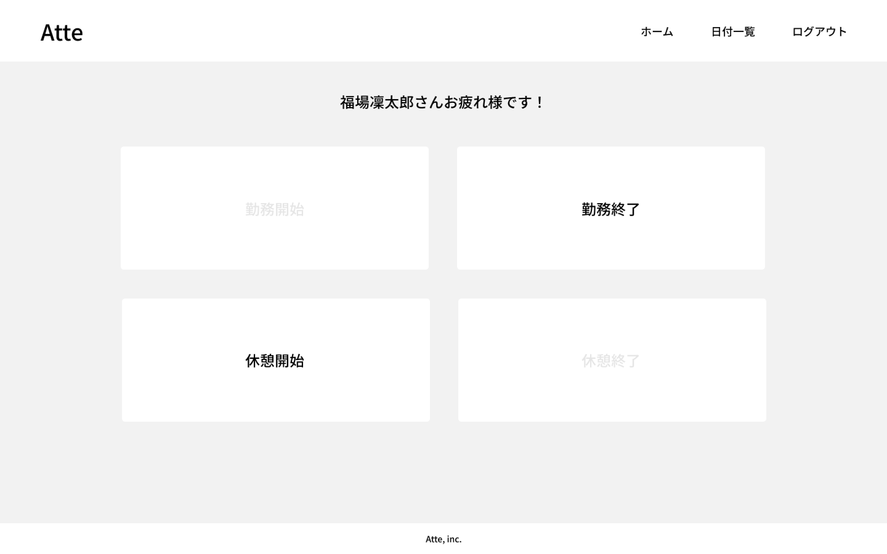

# Case_1

# アプリケーション名: 　Atte

## 目的・目標
目的：人事評価のため
目標：利用者100人達成

## アプリケーションURL
開発環境： http://localhost/
phpMyAdmin: Http://localhost:8080/

「注意事項」
ログインページに移行しますので、ユーザー登録をしてください。

<!-- ##　他のリポジトリ
関係するリポジトリがあれば記載 -->

## 機能一覧
認証機能
　・ユーザー登録
　・ログイン・アウト機能

打刻機能
　・勤務開始・終了の記録
　・休憩開始・終了の記録

勤怠管理
　・日付別勤怠情報の取得

## 使用技術

　開発言語：PHP
　フレームワーク：Laravel　3.8
　バージョン管理：GitHub

## テーブル設計

## ER図

# 環境構築

Dockerビルド
    1.
    2.docker-compose up -d --build

*MySQLは、OSによって起動しない場合があるのでそれぞれのPCに合わせてdocker-compose.ymlファイルを編集してください。

Laravel環境構築

    1.docker-compose exec php bash
    2.composer install
    3..env.exampleファイルから.envを作成し、環境変数を変更してください
    4.php artisan key:generate
    5.php artisan migrate
    6.php srtisan db:seed

##　その他